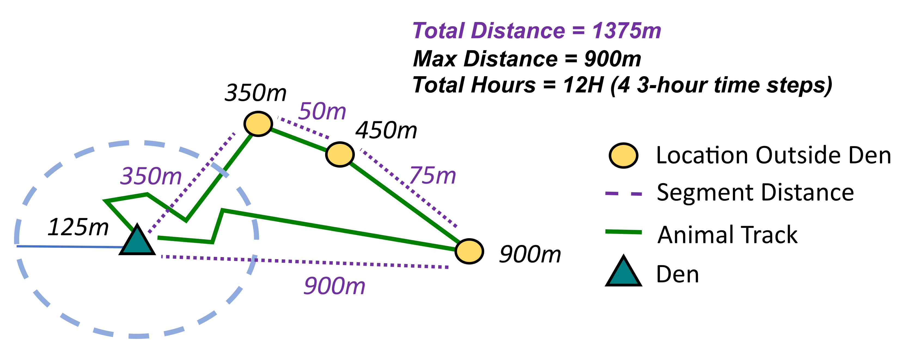
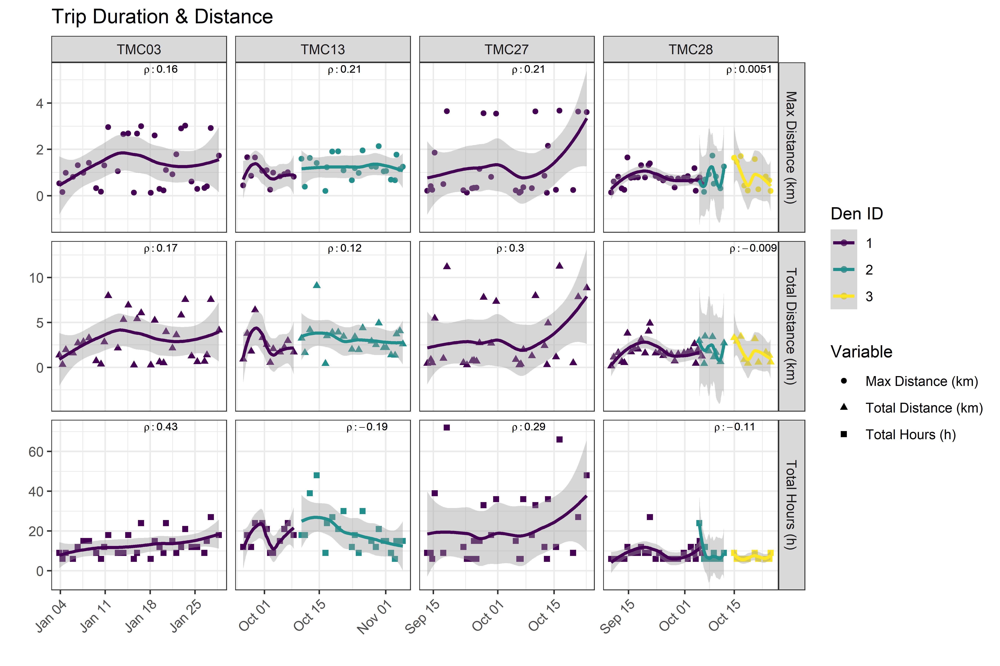
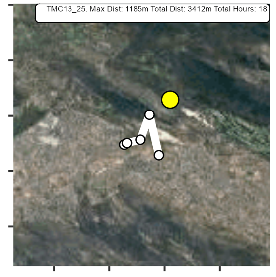
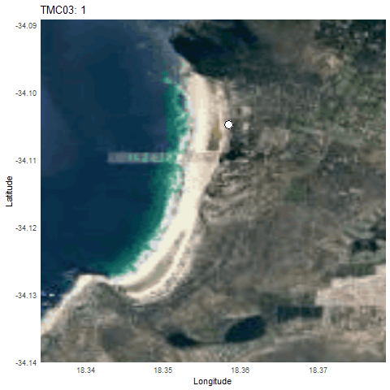
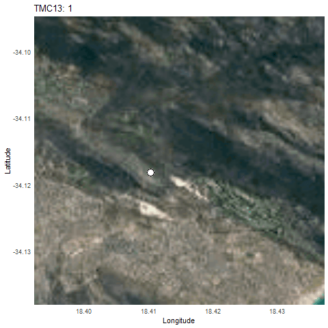
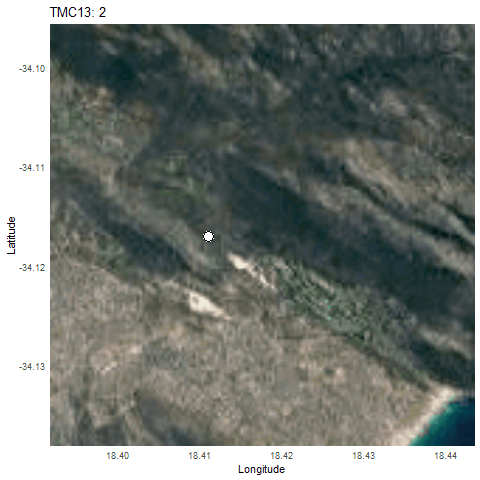
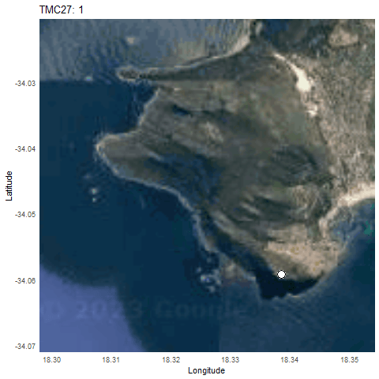
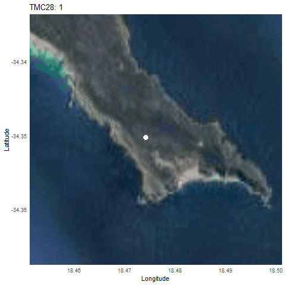
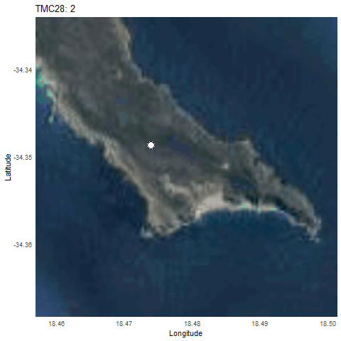
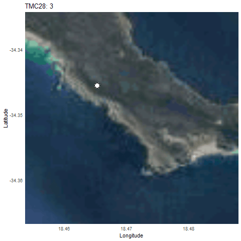

# Caracal Movement Analysis

1. [Dens](#1-dens)
2. [Trip ID](#2-identifying-trips)
3. [Trip Analysis](#3-analyzing-trips)
4. [Plot Trip](#4-plotting-trips)
5. [Animated Trips](#5-animated-trips)

This project analyzes the movement patterns of caracal denning behavior based on location data. Here's a brief overview of the pipeline:

## 1. Dens

Using den location data provided, wherein TMC13 has 2 dens, TMC28 has 3 dens, and the others have 1 den:

| ID    | Cluster | Latitude | Longitude | Den_Start       | Den_End          | Dist_Urban (km) |
| ----- | ------- | -------- | --------- | --------------- | ---------------- | ---------- |
| TMC27 | 1       | -34.0592 | 18.33856  | 9/11/2016 20:00 | 10/25/2016 11:00 | 0.32       |
| TMC28 | 1       | -34.3503 | 18.47401  | 9/10/2016 0:00  | 10/6/2016 6:00   | 14.46      |
| TMC28 | 2       | -34.3487 | 18.47383  | 10/5/2016 0:00  | 10/13/2016 15:00 | 14.16      |
| TMC28 | 3       | -34.3456 | 18.46527  | 10/14/2016 9:00 | 10/25/2016 18:00 | 13.6       |
| TMC13 | 1       | -34.1182 | 18.41024  | 9/24/2015 18:00 | 10/9/2015 9:00   | 0.6        |
| TMC13 | 2       | -34.1171 | 18.41102  | 10/10/2015 0:00 | 11/5/2015 21:00  | 0.6        |
| TMC03 | 1       | -34.1048 | 18.35837  | 1/1/2016 8:00   | 1/29/2016 8:00   | 0.41       |

## 2. Identifying Trips

A trip is defined as a period during which a caracal strays more than 125m away from the den centroid and then returns within this radius. The total duration of a trip includes both entry and exit times. Consequently, even a single location outside the boundary would result in a trip time of 6 hours.

Key measurements for each trip include:

- **Max distance:** This is the Haversine straight-line distance from the den centroid to the farthest point of the trip.
- **Total distance:** This is calculated as the sum of the Haversine distance between successive observations outside the boundary, as well as the distances from the initial and final observations to the den location. 

## 3. Analyzing Trips

The 2 LONGEST (HOURS) Trips by caracal:

| ID    | Den  | Date Start | Time Start | Trip ID           | Max Trip Distance (m) | Total Trip Distance (m) | Total Trip Hours |
| ----- | ---- | ---------- | ---------- | ----------------- | --------------------- | ----------------------- | ---------------- |
| TMC03 | 1    | 1/27/2016  | 11:00:00   | TMC03_Den1_Trip31 | 2921                  | 7533                    | 27               |
| TMC03 | 1    | 1/16/2016  | 14:00:00   | TMC03_Den1_Trip17 | 3003                  | 6052                    | 24               |
| TMC03 | 1    | 1/20/2016  | 11:00:00   | TMC03_Den1_Trip22 | 1104                  | 3965                    | 24               |
| TMC13 | 2    | 10/14/2015 | 8:00:00    | TMC13_Den2_Trip4  | 1414                  | 9071                    | 48               |
| TMC13 | 2    | 10/12/2015 | 14:00:00   | TMC13_Den2_Trip3  | 1625                  | 4180                    | 39               |
| TMC27 | 1    | 9/18/2016  | 8:00:00    | TMC27_Den1_Trip6  | 3648                  | 11168                   | 72               |
| TMC27 | 1    | 10/16/2016 | 8:00:00    | TMC27_Den1_Trip26 | 3667                  | 11249                   | 66               |
| TMC28 | 1    | 9/21/2016  | 2:00:00    | TMC28_Den1_Trip13 | 1397                  | 4898                    | 27               |
| TMC28 | 2    | 10/5/2016  | 2:00:00    | TMC28_Den2_Trip1  | 695                   | 2964                    | 24               |

The 2 FURTHEST (MAX DISTANCE FROM DEN) Trips by caracal:      

| ID    | Den  | Date Start | Time Start | Trip ID           | Max Trip Distance (m) | Total Trip Distance (m) | Total Trip Hours |
| ----- | ---- | ---------- | ---------- | ----------------- | --------------------- | ----------------------- | ---------------- |
| TMC03 | 1    | 1/23/2016  | 11:00:00   | TMC03_Den1_Trip26 | 3021                  | 7538                    | 21               |
| TMC03 | 1    | 1/16/2016  | 14:00:00   | TMC03_Den1_Trip17 | 3003                  | 6052                    | 24               |
| TMC13 | 2    | 10/30/2015 | 5:00:00    | TMC13_Den2_Trip16 | 2137                  | 4924                    | 21               |
| TMC13 | 2    | 10/26/2015 | 2:00:00    | TMC13_Den2_Trip13 | 1951                  | 4399                    | 30               |
| TMC27 | 1    | 10/16/2016 | 8:00:00    | TMC27_Den1_Trip26 | 3667                  | 11249                   | 66               |
| TMC27 | 1    | 9/18/2016  | 8:00:00    | TMC27_Den1_Trip6  | 3648                  | 11168                   | 72               |
| TMC28 | 2    | 10/8/2016  | 20:00:00   | TMC28_Den2_Trip5  | 1731                  | 3398                    | 6                |
| TMC28 | 3    | 10/16/2016 | 20:00:00   | TMC28_Den3_Trip3  | 1707                  | 3440                    | 6                |

The 2 LARGEST (TOTAL DISTANCE) Trips by caracal:              

| ID    | Den  | Date Start | Time Start | Trip ID           | Max Trip Distance (m) | Total Trip Distance (m) | Total Trip Hours |
| ----- | ---- | ---------- | ---------- | ----------------- | --------------------- | ----------------------- | ---------------- |
| TMC03 | 1    | 1/11/2016  | 11:00:00   | TMC03_Den1_Trip11 | 2958                  | 7978                    | 18               |
| TMC03 | 1    | 1/23/2016  | 11:00:00   | TMC03_Den1_Trip26 | 3021                  | 7538                    | 21               |
| TMC13 | 2    | 10/14/2015 | 8:00:00    | TMC13_Den2_Trip4  | 1414                  | 9071                    | 48               |
| TMC13 | 1    | 9/28/2015  | 14:00:00   | TMC13_Den1_Trip4  | 1654                  | 6379                    | 24               |
| TMC27 | 1    | 10/16/2016 | 8:00:00    | TMC27_Den1_Trip26 | 3667                  | 11249                   | 66               |
| TMC27 | 1    | 9/18/2016  | 8:00:00    | TMC27_Den1_Trip6  | 3648                  | 11168                   | 72               |
| TMC28 | 1    | 9/21/2016  | 2:00:00    | TMC28_Den1_Trip13 | 1397                  | 4898                    | 27               |
| TMC28 | 1    | 9/20/2016  | 17:00:00   | TMC28_Den1_Trip12 | 1327                  | 4009                    | 9                |

And spearman's rho between denning time and [distance/hours]: this will see if there is a relationship between putative kitten age and trip characteristics.  

| ID    | Max Trip Distance (m) | Total Trip Distance (m) | Total Trip Hours |
| ----- | --------------------- | ----------------------- | ---------------- |
| TMC03 | 0.158                 | 0.169                   | 0.427            |
| TMC13 | 0.214                 | 0.124                   | -0.192           |
| TMC27 | 0.205                 | 0.296                   | 0.286            |
| TMC28 | 0.00509               | -0.00902                | -0.11            |

**Interestingly, we see relatively strong correlations between denning duration and trip characteristics (max distance, total distance, total hours) for the 2 caracals which only den at 1 location, but these correlations show some conflict (weaker or negative) for caracals which show 2 dens (TMC13) or 3 dens (TMC28). TMC28 shows the weakest correlations with 3 dens, so there seems to be a den number effect..**

## 4. Plotting Trips

To ensure that the results are sensible, I'll plot the trip tracks for each individual. 

Plotted trips can be found within `/figures/` for each caracal in a large PNG. Each trip will look like this, not explictly showing the points within the boundary before and after the trip:

 

## 5. Animated Trips

We can easily visualize these trips in relation to the den for each caracal with GIFS. **IMPORTANT NOTE: this will only show the TRIP SEGMENTS THAT ARE > 125M FROM THE DEN in color. Therefore, it will not plot the connecting points within the den centroid before or after the trip, but each colored point are the segments that make a trip. Max distance and total distance incorporate the segments before and after into the calculations for analysis, but they are not shown here** 

**TMC03: Den 1 **

 

**TMC13: Den 1 **

 

**TMC13: Den 2 **

 

**TMC27: Den 1 **

 

**TMC28: Den 1 **

 

**TMC28: Den 2 **

 

**TMC28: Den 3 **

 

## Contact

For questions pertaining please open an issue or email: Justin Merondun heritabilities@gmail.com 
