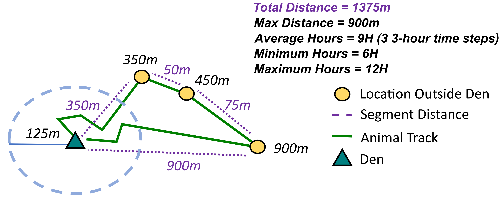

# Caracal Movement Analysis

This project analyzes the movement patterns of caracal denning behavior based on location data. Here's a brief overview of our analysis pipeline:

## 1. Identifying Clusters with DBSCAN

We use the DBSCAN clustering algorithm to identify putative den locations. The parameters for DBSCAN are:

- **Reachability of points (eps):** This is specified in kilometers. We've tested different values until each caracal was associated with a single cluster.
- **Minimum Points (MinPts):** The minimum number of points required to form a dense region.

DBSCAN identified 2 clusters as highly likely  for TMC13 and TMC28, suggesting either a shift in den locations or pre-denning data inclusion. Primary clsuters found in the `Centroids.kml` file.

Primary Clusters: 

| ID    | Latitude | Longitude |
|-------|----------|-----------|
| TMC03 | -34.1048 | 18.3583   |
| TMC13 | -34.1171 | 18.411    |
| TMC27 | -34.0592 | 18.3385   |
| TMC28 | -34.3503 | 18.474    |

## 2. Identifying Trips

A trip is defined as a period during which a caracal strays more than 250m away from the den centroid and then returns within this radius. The total duration of a trip includes both entry and exit times. Consequently, even a single location outside the boundary would result in a trip time of 6 hours.

Key measurements for each trip include:

- **Max distance:** This is the Haversine straight-line distance from the den centroid to the farthest point of the trip.
- **Total distance:** This is calculated as the sum of the Haversine distance between successive observations outside the boundary, as well as the distances from the initial and final observations to the den location. 

## 3. Analyzing Trips

I filter out any trips that last longer than 96 hours (4 days). We also calculate Spearman’s rank correlation between time and value (where value could be max distance, total distance, or duration), to determine whether these patterns change over the course of denning.

| ID    | date start | time start | trip ID  | max dist (m) | total dist (m) | total hours |
| ----- | ---------- | ---------- | -------- | ------------ | -------------- | ----------- |
| TMC03 | 1/16/2016  | 14:00:00   | TMC03 15 | 3002         | 6050           | 24          |
| TMC03 | 1/20/2016  | 11:00:00   | TMC03 18 | 1104         | 3837           | 21          |
| TMC13 | 10/14/2015 | 8:00:00    | TMC13 19 | 1414         | 9070           | 48          |
| TMC13 | 10/12/2015 | 14:00:00   | TMC13 18 | 1626         | 4181           | 39          |
| TMC27 | 11/2/2016  | 23:00:00   | TMC27 35 | 5237         | 21160          | 264         |
| TMC27 | 11/13/2016 | 23:00:00   | TMC27 36 | 3634         | 11131          | 117         |
| TMC28 | 10/13/2016 | 17:00:00   | TMC28 34 | 1162         | 25096          | 324         |
| TMC28 | 9/21/2016  | 2:00:00    | TMC28 12 | 1397         | 4898           | 27          |

But, no particularly strong or consistent signals with these metrics:

## 4. Plotting Trips

To ensure that the results are sensible, I'll plot the trip tracks for each individual. 

Plotted trips can be found within `/figures/` for each caracal in a large PNG. Each trip will look like this, not explictly showing the points within the boundary before and after the trip:

 
